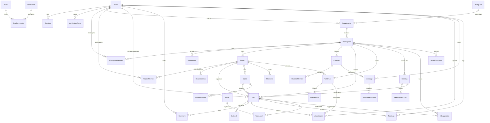

# Loop Entity-Relationship Diagram

This document contains the structural database architecture for **Loop**, derived directly from the Prisma schema in [`packages/db/prisma/schema.prisma`](file:///d:/Cooking%20stuff/PS5%20Devfolio/packages/db/prisma/schema.prisma).

## High-Level Domain Architecture

---

## Detailed Model Catalog by Domain

### 1. Identity & Auth
- **`User`**: Central user identity supporting password authentication, Google OAuth, 2FA, platform administration, and user metadata.
- **`Session`**: Tracks active JWT refresh tokens per device with rotation support and revocation tracking.
- **`VerificationToken`**: Stores hashed tokens for email verification and password resets.

### 2. RBAC (Role-Based Access Control)
- **`Role`**: Enum-backed roles (`OWNER`, `PM`, `MEMBER`, `CLIENT`) mapped with explicit power rank.
- **`Permission`**: Granular permissions (e.g. `task.update`, `workspace.manage`).
- **`RolePermission`**: Junction table mapping roles to their permitted capabilities.

### 3. Multi-Tenancy & Workspace
- **`BillingPlan`**: Enterprise plan tier definition (seats, price, features JSON).
- **`Organization`**: Top-level billing and ownership entity.
- **`Workspace`**: Isolated multi-tenant boundary. Every data table links back to a `workspaceId` for tenant isolation.
- **`Department`**: Organizational sub-groups within a workspace.
- **`WorkspaceMember`**: Junction mapping users to workspaces with specific roles and capacity hours.
- **`Invite`**: Email invitation system for prospective workspace members.

### 4. Projects & Sprints
- **`Project`**: High-level project container (key prefix e.g., `TASK`, status, priority, auto-apply flags).
- **`ProjectMember`**: Granular project-level access assignment.
- **`BoardColumn`**: Custom per-project Kanban board columns (`key`, `name`, `order`, `wipLimit`, `isDone`).
- **`Milestone`**: Target delivery dates and groupings.
- **`Sprint`**: Time-boxed execution cycles with story point capacity goals.
- **`BurndownPoint`**: Daily points snapshot tracking sprint progress.

### 5. Task Management
- **`Task`**: Core work item (`projectId-number` e.g., `PAY-12`, status, assignee, reporter, points, estimates, blockage flag).
- **`Subtask`**: Checklists inside tasks.
- **`TaskDependency`**: Blocker-blocked relationship graph between tasks.
- **`Label` / `TaskLabel`**: Taxonomy tags per workspace/project.
- **`Comment`**: Rich-text comments on tasks with @mention support.

### 6. Wiki & File Management
- **`Folder`**: Hierarchical document and file organization.
- **`Attachment`**: File assets stored on Cloudinary or local disk with version replacement tracking.
- **`WikiPage`**: Knowledge base pages with hierarchical parent-child nesting and client visibility flags.
- **`WikiVersion`**: Full revision history tracking for wiki edits.

### 7. Real-Time Communication & Scheduling
- **`Channel`**: Project channels or direct messaging channels.
- **`ChannelMember`**: Read states and channel membership.
- **`Message`**: Real-time Socket.IO chat messages with thread support and soft deletion.
- **`MessageReaction`**: Emoji reactions on chat messages.
- **`Meeting`**: Calendar items with agendas, start/end timestamps, and action item links.
- **`MeetingParticipant`**: Invitation and RSVP tracking for meetings.
- **`Holiday`**: Workspace non-working calendar days.
- **`TimeLog`**: Granular timer and manual work logs per task and project.

### 8. AI Intelligence, RAG & Auditing
- **`AiSuggestion`**: Auto-Pilot suggestions inbox (`kind`, `confidence`, `evidence` JSON, `proposedChange` JSON, `status`).
- **`HealthSnapshot`**: Explainable score history with computed arithmetic signals, top actions, and AI narrative.
- **`Embedding`**: pgvector embeddings storing 768-dim vectors for semantic workspace RAG filtered by visibility.
- **`AskLog`**: Query log for AI search and citations.
- **`Notification`**: Real-time user notifications.
- **`ActivityLog`**: Activity timeline feed for tasks and projects.
- **`AuditLog`**: Immutable security audit trail for privileged actions.
- **`Integration`**: Config for GitHub webhooks and external services.
- **`Setting` / `FeatureFlag`**: Dynamic workspace configurations and feature rollouts.
